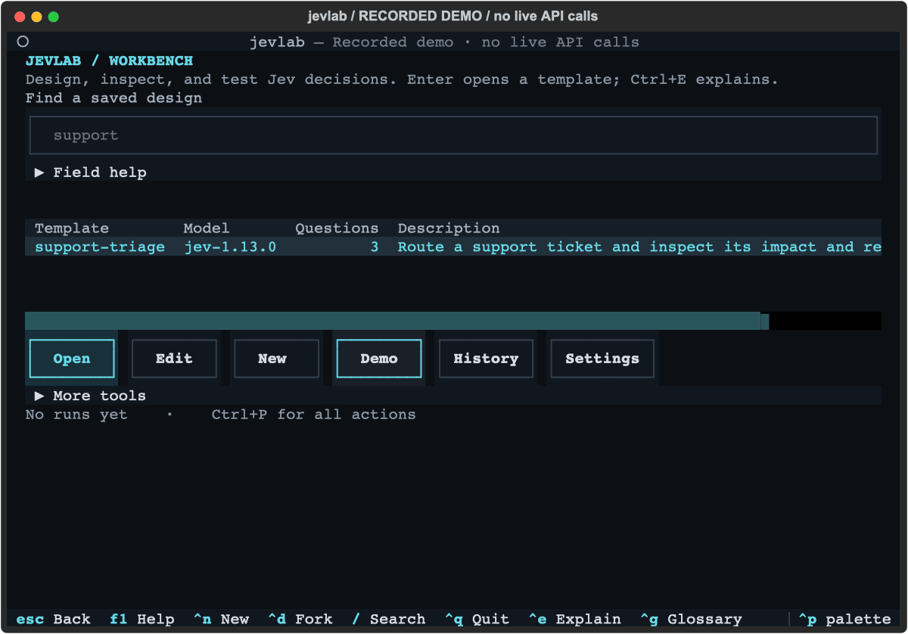

# JevLab

A terminal workbench for designing, inspecting, and testing TypeSafe Jev decisions.
Edit a question, see its probabilities, evaluate it on labeled examples, and export it into your application.

[](https://github.com/javsanesq/jevlab/actions/workflows/ci.yml)
[](LICENSE)

[Quickstart](docs/QUICKSTART.md) · [Documentation](docs/README.md) · [Contributing](CONTRIBUTING.md)



[Static screenshot](docs/assets/playground.svg)

*Recorded example with synthetic values, not a live response or an accuracy benchmark.*

## What is Jev?

[Jev](https://docs.typesafe.ai/introduction/quickstart) is TypeSafe's model for small,
structured judgments. Given text or JSON, it can choose an option (**Choice**),
place something on a defined scale (**Score**), or estimate a yes probability
(**Noul**). Examples include routing a support ticket, checking a claim against
retrieved evidence, or deciding whether an agent should retry.

JevLab is an independent workbench around the official SDK. It helps you examine
those judgments before integrating them. It does not execute the suggested action;
your application remains responsible for policy and side effects.

## Install

**Supported: macOS, Python 3.12+, [uv](https://docs.astral.sh/uv/getting-started/installation/).**
Linux and Windows are not currently supported. Installation is from source;
JevLab is not yet published on PyPI.

```sh
git clone https://github.com/javsanesq/jevlab.git
cd jevlab
make install
jevlab --version
```

`make install` checks for conflicting commands and performs an editable uv tool
installation. Keep the checkout: source edits apply immediately. If `make` is
unavailable, run `uv run python scripts/install.py`. If your shell cannot find
`jevlab`, run `uv tool update-shell` and open a new terminal.

Upgrading from `jev`? Saved templates, history, and keys remain available;
read the [upgrade notes](docs/REFERENCE.md#upgrading-from-jev).

## First result

Start with a recorded example. It needs no account, API key, or network request:

```sh
jevlab demo
```

Press **Ctrl+Q** to leave the full-screen view. To make a real request, obtain a
[TypeSafe API key](https://console.typesafe.ai/keys), then use the hidden prompt
in configuration to save it in macOS Keychain:

```sh
jevlab config
jevlab
```

Open `support-triage`, change the sample message, and press **Ctrl+R** to call Jev.
The result shows probabilities, review routing, latency, tokens, and an estimated
cost calculated from returned usage. **Single runs start immediately and are
billable.** Batch and evaluation workflows include cost checks.

For scripting, the same decision is available without the TUI:

```sh
printf '%s' '{"ticket":{"message":"I was charged twice. Please refund one charge."}}' \
  | jevlab run support-triage --state - --json
```

JSON output uses a versioned envelope; diagnostics stay on stderr.
[Input formats, exit codes, and error details](docs/REFERENCE.md#cli-and-pipes).

## The workbench workflow

| Task | Start here |
| --- | --- |
| Create or edit a reusable YAML design | `jevlab` → **New** or **Edit** |
| Run one case and inspect probability bars | Open a template → **Get answers** |
| Edit a design in your project | `jevlab templates edit ./decision.yaml` |
| Reproduce a saved result | `jevlab history` |
| Check labeled examples and tune review thresholds | `jevlab eval` |
| Check regressions against saved cases | `jevlab eval compare baseline.json candidate.json` |
| Compare two designs on the same case | `jevlab compare --help` |
| Process a CSV or JSONL file with checkpoints | `jevlab batch --help` |
| Generate a standalone typed SDK module | `jevlab export support-triage --lang python --output decision.py` |

New templates start with one question and send every result to review until you
set thresholds. A review recommendation is local routing information, not an
actual handoff. Validate thresholds on representative held-out examples;
confidence alone is not a guarantee of correctness.

**Keyboard:** Ctrl+P opens the command palette, Ctrl+E explains a focused control,
Esc goes back, and Ctrl+Q quits. The tour is optional: `jevlab tour`.
Optional lessons, example patterns, and coach providers remain available through
**More tools**, the palette, and CLI commands. The local HTTP server is an advanced
CLI feature; see `jevlab serve --help`.

## Documentation

- [Quickstart](docs/QUICKSTART.md): installation, first call, first design.
- [Project workflow](docs/PROJECTS.md): project YAML, portable baselines, quality checks, and held-out verification.
- [Command reference](docs/REFERENCE.md): YAML, JSON contracts, evaluation, batch, costs, and settings.
- [Python and framework exports](docs/INTEGRATIONS.md): integrate a tested design.
- [Beginner's guide](docs/GUIDE.md): step-by-step explanations, including Terminal basics.
- [Research](docs/RESEARCH.md) and [design decisions](docs/DECISIONS.md): API evidence and tradeoffs.

New profiles live under `~/.jevlab/`; `JEVLAB_HOME` selects an isolated profile.
Keys use Keychain or provider environment variables, never template files.
Run inputs and responses are stored locally in SQLite. Live Jev calls send your
state and questions to TypeSafe; optional coaching sends selected material to
its separate provider. See [storage and privacy](docs/REFERENCE.md#storage-costs-and-privacy).

## Development

```sh
uv sync --locked --all-extras
make lint
make test
make dev
```

Ruff, Pyright, and pytest run in CI on macOS. Tests use isolated profiles and
mocked provider transports; they require no API keys or paid calls. Live tests
are opt-in. See [contribution instructions](CONTRIBUTING.md) for the architecture
and verification workflow, and [CHANGELOG.md](CHANGELOG.md) for version history.

Built by Javi. Licensed under [MIT](LICENSE). Not affiliated with TypeSafe.
