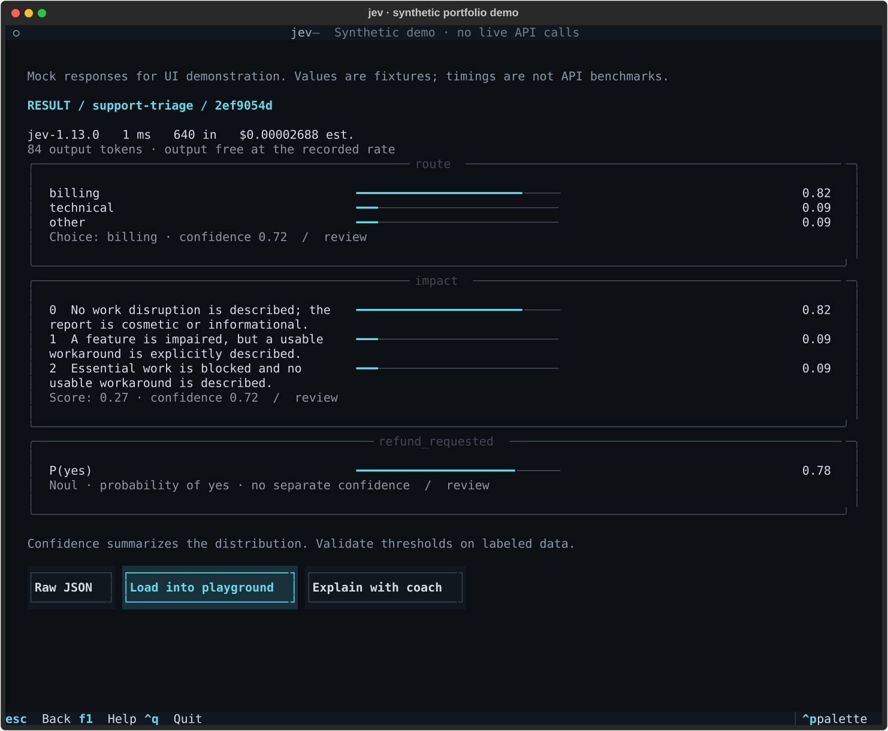
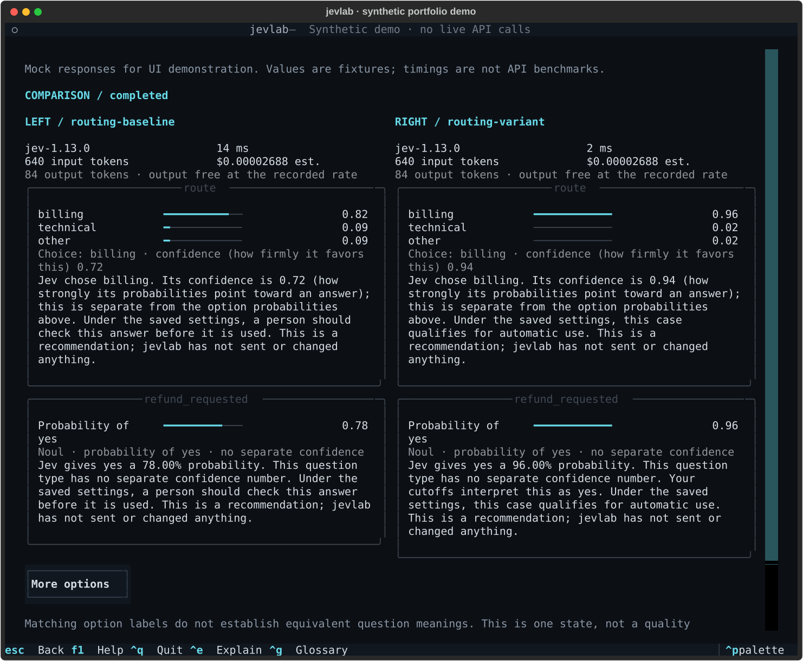
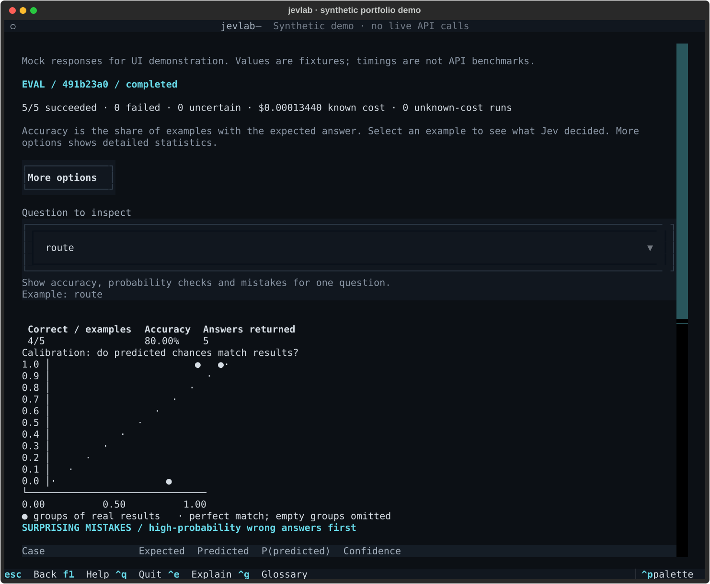
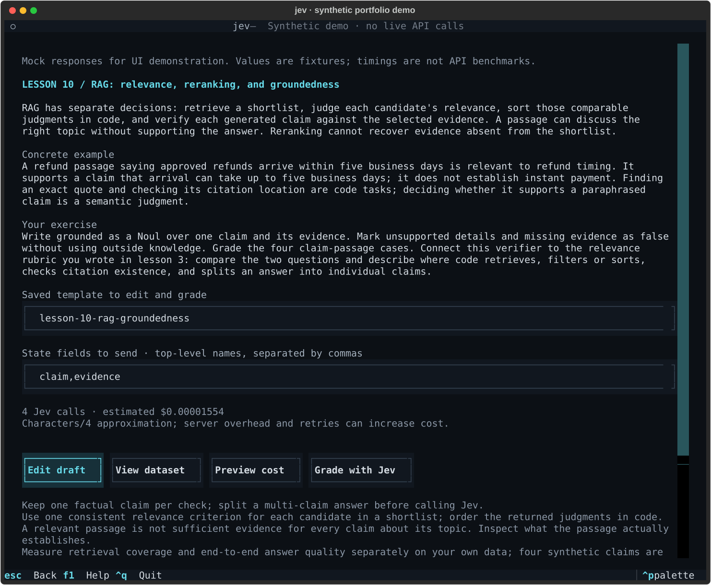

# jev workbench/harness

A place to try small AI judgments and understand their answers. Give it a customer
message, for example, and ask which team should help, how disruptive the problem
is, and whether the customer wants a refund. See the alternatives, uncertainty,
and the rule for when a person should check the result.

The **Jev model** is made by TypeSafe. This independent **jev workbench** helps you
use it from your Mac's terminal. It saves reusable designs, results, and learning
progress. It does not send customer messages, issue refunds, or execute the
model's suggested action. An optional coach can suggest clearer questions.

**Start here:** [One-page quickstart](docs/QUICKSTART.md) ·
[Complete beginner's guide](docs/GUIDE.md).
The guide assumes no terminal experience and includes installation, a free demo,
a real worked example, and troubleshooting.

## Try it

If already installed, run one command at a time:

```sh
jev tour
jev demo
jev guide
```

The tour introduces the app. The demo is a clearly labeled illustrative recording
stored on disk: no key, network request, or charge. The guide is available offline;
`jev guide --web` opens a local browser copy. To use the live model, save your
TypeSafe key in macOS Keychain through the tour or `jev config`.

Run `jev` to open the workbench. **Ctrl+E** explains the focused control,
**Ctrl+G** opens the glossary, **Esc** goes back, and **Ctrl+Q** quits.
Simple mode is the default; **More options** reveals advanced controls.
Every form field has a label, explanation, example, and local validation where
needed. Field help is visible in Simple mode and expandable in Expert mode.
Single Jev runs start immediately. Results show latency, token usage, and cost
calculated from returned usage. Batch and eval prompt before starting, with a
separate **Don't ask again** choice for each. Other paid workflows, such as coach
advice and comparisons, still confirm. Estimates are not spending caps; JSON,
piped, and unattended commands keep their existing scripting budget rules.

## What you can do

| Use | Start here |
| --- | --- |
| Try and edit a reusable decision design | `jev` |
| Revisit saved results | `jev history` |
| Practice with ten short lessons | `jev learn` |
| Browse seven example patterns | `jev library` |
| Test accuracy and tune human-review rules | `jev eval` |
| Process a file of cases | `jev batch` |
| Compare two designs | `jev compare` |
| Ask an optional design coach | `jev coach` |
| Check local setup | `jev doctor` |



This synthetic example shows the Expert-style result view. It is not a performance
benchmark or live inference. [Reproduce the screenshots](#portfolio-screenshots).

## Developer setup

Requires macOS and Python 3.12+, managed with
[uv](https://docs.astral.sh/uv/getting-started/installation/). The beginner guide
uses a ZIP download; developers can clone the [repository](https://github.com/javsanesq/jevlab).
This repository is now named **jevlab**. The installed command is still `jev` and
data still lives in `~/.jev/`; the command and data migration will follow in a
separately reviewed phase.
From the project folder:

```sh
make install
make lint
make test
```

`make install` warns about a conflicting command and installs editable source
into uv's separate tool environment. It preserves installed coach extras. Source
edits apply immediately; reinstall after dependency changes. For an installer
that does not require make, use `uv run python scripts/install.py`.

All actual decisions use the official TypeSafe SDK directly. The coach proposes
and critiques only. Offline tests mock HTTP and block network connections;
opt-in live tests are separate. `core` has no UI or coach imports.

Version history and release rules: [Changelog](CHANGELOG.md) ·
[Releasing](docs/RELEASING.md). This clean repository starts at 0.7.0. Earlier
development milestones remain as historical documentation; old tags are not
recreated here. See the [publication record](docs/PUBLICATION.md).

## Technical reference

The following sections are for scripting, integrations, and detailed configuration.
The [beginner's guide](docs/GUIDE.md) covers the guided screens first.

## Optional coach

Anthropic Messages and OpenAI Responses are supported through their official SDKs.
The coach starts disabled. TypeSafe alone is sufficient for the workbench and
lessons. Install coach dependencies in the **global tool environment** (installing
them only in the project's development environment is insufficient):

```sh
cd ~/jevlab
make install COACH=both       # or COACH=anthropic / COACH=openai
jev config --provider anthropic
```

Later `make install` upgrades preserve the coach extras already installed.
Keep using your existing source folder if it is still named `~/jev`.
Setup stores keys in macOS Keychain, with `ANTHROPIC_API_KEY` and `OPENAI_API_KEY`
as environment fallbacks. Never put a key in a command argument or configuration
file. Each provider now keeps its own configurable model: `anthropic_model`
defaults to `claude-haiku-4-5-20251001`; `openai_model` defaults to `gpt-5.6-luna`.
These API identifiers were verified on 2026-09-20; your account must have access.
Existing choices are preserved; the display name `Opus 5` becomes `claude-opus-5`.
Provider/model selection is also in Settings, or use:

```sh
jev config --set coach_provider=anthropic --json
jev doctor --coach --offline
jev doctor --coach
jev coach
jev coach design 'Check one claim against retrieved evidence' \
  --name grounding-proposal --output ./proposal.yaml --json
jev coach critique my-grounding --json
jev coach explain RUN_ID --json
```

`jev doctor --coach` reports both installed SDKs, key sources (never key values),
and model IDs. It shows an estimated price and asks before making **one small live
request per ready provider**, with no automatic retries. The request critiques a
built-in synthetic template; no personal state or history is sent or saved.
An HTTP success only passes if the returned coaching advice also validates.
Errors show the provider's redacted message and a specific next step, including
rejected keys, model access, billing, rate limits, and network failures.

For scripts, inspect readiness and estimates without spending, then explicitly
authorize the live requests:

```sh
jev doctor --coach --offline --json
jev doctor --coach --yes --json
jev config --set coach_provider=openai --json
```

The diagnostic JSON uses the existing versioned envelope; partial failures retain
both provider reports in `data`. Exit 3 means setup or authorization is needed;
exit 4 means a live check failed. The ordinary `jev doctor` stays offline.
The older `coach_model` setting remains an alias for the selected provider's model;
switching providers no longer carries the other provider's model across.

Review a proposed design with **Edit proposal** before saving. CLI `--output` writes
a validated proposal to a new file; it does not install or execute it. After editing,
import with `jev templates new NAME --from ./proposal.yaml`. The builder palette
also offers critique, and results have an **Explain with coach** button.

Advice is grounded in a dated TypeSafe design/jaggedness guidance snapshot and
includes one suggested experiment. Explanations are hypotheses, not a Jev reasoning
trace. When enabled, the coach can give feedback after lesson grading; interactive
use asks separately before this additional paid request. Declining feedback or a
coach failure cannot change or erase the grade.

Coach actions send selected designs/states to the separate provider. OpenAI requests
set `store=False`; this does not establish ZDR. Before an interactive request, known
models use dated standard rates for an estimate; other model prices stay unknown.
Coach token usage is shown after the call, while final account cost remains unknown.
Output is bounded by
`coach_max_output_tokens` (4096) and `coach_timeout_seconds` (60). Invalid/truncated
proposals are rejected. Regular coach panels are not retained after exit; lesson
feedback is saved with the attempt. Disable via
`jev config --set coach_provider=disabled --json`.

## CLI and pipes

Every implemented command accepts `--json`. Put it after the command/subcommand.
JSON stdout is one envelope: `{"schema_version":1,"ok":true,"data":...}` or
`{"schema_version":1,"ok":false,"error":...}`. Diagnostics go to stderr.
JSON mode does not prompt for text or open the TUI; macOS may still require
permission to access Keychain. Use environment mode for unattended execution.

```sh
jev --version
jev templates --json
jev templates new my-triage --from ~/.jev/templates/support-triage.yaml --json
jev templates edit my-triage
jev templates validate ~/.jev/templates/my-triage.yaml --json

printf '%s' '{"ticket":{"message":"I was charged twice. Please refund one charge."}}' \
  | jev run support-triage --state - --json

jev run support-triage --state ./ticket.json --json
jev run support-triage --text '{"ticket":{"message":"The export button is broken."}}' --json
jev history --template support-triage --status succeeded --json
jev history --search refund --json
jev history show RUN_ID --json
jev history rerun RUN_ID --json
```

`--state -` defaults to JSON output even without `--json`. The input format comes
from the template, with an explicit `--format text|json` override available.
Imports are limited to 2 MB of UTF-8 text. JSON state must be a string, object,
or array. Run IDs accept unambiguous prefixes. History JSON includes daily and
per-template totals across all retained runs, separate from the filtered list.

| Exit code | Meaning |
| --- | --- |
| 0 | Command completed; inspect doctor findings or routing separately |
| 2 | Invalid arguments, input, configuration, or local storage |
| 3 | Missing credential or unavailable Keychain |
| 4 | API, network, timeout, or response-validation failure |
| 130 | Interrupted CLI command |

Failures after run creation include a `run_id` for inspection. No API error is
silently replaced with a successful judgment. Retryable failures include a
suggested fix and a `retryable` flag.
Provider failures retain their message, HTTP status, request ID, and a
credential-redacted response body. F2 opens those details in the TUI;
`jev --verbose history show RUN_ID` shows them for a saved failure in the CLI.
Older failures may lack a body because earlier versions discarded it.

## Templates and keys

Templates are human-readable YAML with a versioned envelope around the official
SDK question types. See the complete [starter template](src/jev/resources/support-triage.yaml)
and [schema and architecture](docs/PLAN.md).

```yaml
schema_version: 1
name: refund-check
description: Detect an explicit request for money back.
model: jev-1.13.0
state:
  description: The customer's message, without unrelated conversation history.
  format: text
  example: Please refund the duplicate charge.
questions:
  refund_requested:
    type: noul
    instructions: Does the customer explicitly request money back?
    criteria:
      "true": An explicit request to return a payment.
      "false": No explicit request to return a payment.
thresholds:
  refund_requested:
    kind: noul_probability
    no_at_or_below: 0.10
    yes_at_or_above: 0.90
notes: Illustrative cutoffs; validate on labeled examples.
```

The builder edits metadata and individual questions in guided forms, with an
advanced YAML editor. Labels, examples, and edit-time errors explain instructions,
criteria, ordered Score levels, models, state format, and human-review thresholds.
It validates SDK types and local rules before an atomic save. Choice requires
2–255 options; Score requires 2–10 levels.
Duplicate keys, YAML aliases/tags, invalid thresholds, and unsafe names are rejected.
Quote Noul's `true` and `false` YAML keys. State description/example, notes, and
thresholds remain local metadata; only state, model, and questions are sent.

| Key | Action |
| --- | --- |
| Ctrl+P | Search command palette |
| Tab / Shift+Tab | Move focus |
| Enter | Open selected template/run; activate controls |
| Ctrl+N / Ctrl+D | New / fork template in the browser |
| / | Search in template browser or history |
| Ctrl+S | Validate/save in builder or settings; apply in dialogs |
| Ctrl+O / Ctrl+R | Load state file / call Jev in playground |
| Esc | Back or cancel; protect unsaved drafts |
| ? / F1 | Help; use F1 while typing in a field |
| Ctrl+Q | Quit, checking unsaved drafts |

The dark theme uses grayscale and a cyan accent. `NO_COLOR` is respected.
A terminal of at least 100 columns is comfortable; the home screen also supports
80×24. Longer forms and results scroll.

## Storage, costs, and privacy

Application data lives in `~/.jev/`:

```text
config.toml          nonsecret settings
templates/*.yaml     current reusable designs
jev.db               runs, template revisions, lesson progress/attempts, migrations
```

`JEV_HOME` overrides this directory for isolated profiles/tests. Source and uv's
managed Python environments live separately. Files are created with private
permissions; inputs and responses are ordinary local SQLite data, not encrypted
by the application. The app creates no persistent payload logs.

New templates default to **jev-1.13.0**. Aliases are accepted, and runs retain both
requested and returned model IDs. The verified published rate is **$0.042 per
million input tokens, output free**, dated 2026-09-20. Cost is an estimate based on
reported usage and a saved rate snapshot, not a billing receipt. Unknown usage
or unknown model pricing stays unknown. Totals count unknown-cost runs separately.
Latency measures the complete SDK call, including retries, excluding Keychain lookup.
Comparison timings also include the brief wait to register both linked history rows.

Requests use the SDK's two retries by default, a 10-second timeout per HTTP
operation, and a 45-second overall deadline including credential lookup. Keychain
lookup is limited to five seconds (or the shorter overall deadline); a lookup
timeout reports that no API request was sent. Configure request limits with
`jev config --set max_retries=2 --set timeout_seconds=10 --set deadline_seconds=45`.
Comparisons perform one bounded shared key lookup before the two per-call
deadlines. Doctor's preliminary credential inventory is also bounded; its online
models check then uses the configured request deadline separately.
Cancellation cannot establish whether the server completed or billed a request;
interrupted/failed calls retain that uncertainty. A hard process kill can leave
a pending record. Context counts use a character-based approximation; the server
enforces the actual 64k total / 32k state-plus-longest-question limits.

Live docs describe No Training as a policy and ZDR as an enterprise arrangement;
the SDK exposes no documented per-request toggles. Settings report these facts
without pretending to enable or verify ZDR. See [verified research](docs/RESEARCH.md).

History maintenance is active: by default, eligible history expires after **90 days**
or when the database exceeds **100,000,000 bytes**, whichever applies first. It runs
at startup and after runs, at most once per minute in a long-lived process. It also
compacts SQLite/WAL files. To inspect or apply cleanup yourself:

```sh
jev clean --dry-run --json
jev clean --json
jev doctor --json
jev config --set retention_days=90 --set retention_bytes=100000000 --json
```

The TUI's **Cleanup** screen previews eligible records before applying the current
policy. Related reports, lesson attempts, runs, and rerun ancestors expire together,
using their newest activity. Learning achievements and dataset registrations remain;
expired attempts can no longer be inspected. Pending/active work and the current
result are protected, so large active collections can temporarily exceed the cap.
Templates, configuration, external datasets, and exported files are never pruned.
The budget covers SQLite plus WAL, not the entire source or profile directory.

## Evaluate, tune, batch, and compare

Open `jev eval`, `jev batch`, or `jev compare` directly, or choose them from the
home screen / Ctrl+P palette. Evals and batches share row checkpoints, cost
previews, cancellation, and explicit resume controls. Every returned answer comes
from the official Jev SDK; calculating metrics and moving sliders is local.

Try the three-case synthetic fixture shipped with the source:

```sh
cd ~/jevlab
jev datasets import examples/support-eval.jsonl --template support-triage --json
jev eval plan support-triage examples/support-eval.jsonl --json
jev eval run support-triage examples/support-eval.jsonl --concurrency 4 --rate 2 --json
jev eval --json
jev eval show JOB_ID --json
```

The `run` command makes three billable calls. The example tests plumbing and
illustrates the format; it is not a performance benchmark. Use representative,
independently labeled data for your own decisions. To use a library design:

```sh
jev library fork support-routing my-routing
jev library export-data support-routing ~/Downloads/routing-exercise.jsonl --json
jev eval run my-routing ~/Downloads/routing-exercise.jsonl --json
```

Export refuses to overwrite an existing file. It strips teaching notes from the
rows, preserving states and labels. Large input files are referenced by absolute
path and SHA-256 in SQLite, never copied into the data directory.

### Dataset format

JSONL has one object per line. `id` is optional (generated as `row-1`, etc.).
`state` is nonempty text, a JSON object, or an array. Eval rows require an expected
label for **every question**; batch rows may omit labels. Unknown fields/question
IDs, duplicate IDs/JSON keys, missing labels, nonfinite numbers, and malformed
rows fail validation before calls begin.

```json
{"id":"ticket-1","state":{"ticket":{"message":"Please refund the duplicate charge."}},"expected":{"route":"billing","impact":0,"refund_requested":true}}
```

Choice labels exactly match option keys. Score labels are zero-based integer
levels. Noul labels are JSON booleans. CSV uses `state`, optional `id`, and
`expected.<question>` columns; when the template expects JSON, the state cell
contains escaped JSON. Noul CSV labels are lowercase `true` / `false`:

```csv
id,state,expected.route,expected.impact,expected.refund_requested
ticket-1,"{""ticket"":{""message"":""Please refund the duplicate charge.""}}",billing,0,true
```

Imports stream source rows and currently accept up to **10,000 rows, 100 MiB per
file, and 1 MiB per row**. Split larger files. Evals retain compact observations
for interactive analysis; complete inputs and responses remain in ordinary run
history. The dataset registry stores metadata, not a second copy of the states.

### Read the metrics and choose thresholds

The report shows per-question accuracy, ten reliability bins, a reliability
chart, Choice confusion matrices, worst misses linked to individual runs,
tokens, estimated costs, latency mean/p50/p95, and returned model versions.

- Accuracy counts all labeled rows, including failed or unrun cases. Returned-
  answer accuracy is also available in JSON. Failure counts are explicit.
- Choice is exact match; Score uses the nearest level (halves up) and also reports
  continuous mean absolute error; Noul uses `P(yes) >= 0.50` for its baseline grade.
- Calibration compares the **predicted class probability** with observed
  correctness. For Score this is the probability of the rounded level; for Noul
  it is `max(p, 1-p)`. Empty bins have no accuracy. API confidence is a separate
  statistic and is not labeled as a calibrated probability of correctness.
- Brier scores use squared probability error: summed across classes for Choice/
  Score (range 0–2), and binary error for Noul (0–1). Calibration, Brier, and Score
  MAE exclude failed/missing answers. Worst misses are sorted by predicted-class
  probability; both probability and SDK confidence are shown.

Choose **Tune thresholds** in an eval report. Tab to a slider and use Left/Right
for 0.01 steps, Home/End for endpoints. Choice/Score use their SDK confidence;
Noul has independent no/yes probability boundaries. Live coverage divides by all
labeled cases; automated accuracy divides by automated cases only, and is unknown
when no case is automated. Saving writes only adjusted gates into the YAML;
changed question/model designs must be evaluated again.

```sh
jev eval tune JOB_ID route --threshold 0.90 --json
jev eval tune JOB_ID refund_requested --no-below 0.10 --yes-above 0.90 --json
jev eval tune JOB_ID route --threshold 0.90 --save --json
```

Thresholds fitted on an eval describe that dataset. Check a separate holdout
before relying on them. Pin a model version when comparing designs or tuning
thresholds; aliases can change, including between resumed calls. Reports expose
returned versions so mixed-model jobs are visible.

### Run and resume a batch

```sh
jev batch support-triage --input examples/support-eval.jsonl --output ~/Downloads/jev-results.jsonl --concurrency 4 --rate 2 --json
jev batch --json
jev batch --resume JOB_ID --json
jev batch --resume JOB_ID --retry-failed --json
```

Use a new output path. Every attempted row is checkpointed in SQLite; the JSONL
output is an atomic snapshot written on completion or graceful cancellation.
Each output row includes its job/template/dataset identity, case/label metadata,
and complete recorded run. A no-op resume can rebuild output without repeating
successful calls. Output changed by another program is not overwritten; choose a
new output path. A job lock prevents two processes resuming the same job.

Resume uses the saved template and checks the original dataset. Completed rows
are not repeated. Changes during job preparation stop the job before any request;
restore the original file to resume, or preview a new job for changed inputs.
Preparation failures are saved with their reason and completion time.
Cancelled or crashed requests may have finished remotely;
`--retry-unknown` explicitly permits retrying them and may incur duplicate cost.
Authentication errors stop scheduling more work; completed rows stay saved.
Evals also accept `--resume`, `--retry-failed`, and `--retry-unknown` with the
original template name and dataset arguments.

The default is four workers and two new logical calls/second. SDK retries use the
SDK's backoff and may add requests beyond that start rate. This is not a token-
rate limiter. Cost previews use character estimates, exclude unknown overhead/
retry charges, and are **not spending caps**. Interactive batch and eval each
ask before starting, including small jobs. The TUI offers a **Don't ask again**
checkbox; the interactive CLI asks whether to remember an accepted choice.
The preferences are separate and can be restored in Settings or with
`jev config --set confirm_batch_cost=true` and
`jev config --set confirm_eval_cost=true`. `--yes` skips a prompt for one command
without changing preferences. JSON/noninteractive jobs still require explicit
`--yes` above `confirm_cost_usd` (default $1.00), or for an unknown model price;
interactive preferences do not waive this scripting safeguard. Failed jobs return a saved
report with `ok: false` and exit code 4; inspecting that report later succeeds.

### Compare designs or model versions

```sh
jev templates new support-variant --from ~/.jev/templates/support-triage.yaml --json
jev templates edit support-variant
jev compare support-triage support-variant --text '{"ticket":{"message":"Please refund the duplicate charge."}}' --json
```

The TUI shows both results side by side with probability and value differences.
CLI also accepts `--state FILE`, `--state -`, `--left-model`, and `--right-model`.
Both designs receive identical state; each side is a real recorded call. Numeric
deltas are suppressed for missing answers or changed primitive types/criteria.
Matching criteria alone do not guarantee equivalent question meanings. A single
comparison does not establish which design is better across your workload.

## Export a decision into your project

Choose **Export** in the TUI to preview a standalone module, or use:

```sh
jev export support-triage --lang python --output ~/Downloads/decision.py
jev export support-triage --lang langchain --output ~/Downloads/decision_chain.py --json
jev export support-triage --lang pydantic-ai --output ~/Downloads/decision_tool.py --json
```

Use new output paths; existing files are never overwritten. Exports preserve the
saved model, questions, and thresholds, and contain typed sync/async result handling.
They require the official SDK, use `TYPESAFE_API_KEY` from the receiving process,
and do not depend on `jev` or its local profile. For example, in your own project:

```sh
uv add 'typesafe-sdk==0.7.0'
```

```python
from decision import evaluate

result = evaluate({"ticket": {"message": "Please refund the duplicate charge."}})
gate = result.routing["route"]
if gate.disposition == "automate":
    print(gate.value)
else:
    print("Send to human review")
```

LangChain exports a Runnable; Pydantic AI exports a Tool for an existing agent.
Both wrap the same SDK call and response validation. See
[tested versions, installation, and complete examples](docs/INTEGRATIONS.md).
Framework packages are not required to export. Exported modules include the
template's examples and notes, so review those before publishing them.

## Local HTTP API

`jev serve` runs in the foreground on **127.0.0.1**, using saved templates and the
same credentials, history, routing, and direct official SDK as the workbench.
Set a separate local access token in your shell; it is not your TypeSafe key:

```sh
export JEV_SERVER_TOKEN="$(python3 -c 'import secrets; print(secrets.token_urlsafe(32))')"
jev serve --check --json
jev serve --port 8766
```

Press Ctrl+C to stop. `--check` validates configuration without opening a listener
or checking provider connectivity. `--json` on a running server emits one startup
envelope after binding; poll `/health` for readiness. The token exists only in the
environment and must also be supplied to your client (for example, start that client
from the same configured shell). Never reuse a provider key as the local token.

| Route | Purpose |
| --- | --- |
| `GET /health` | Local process health, without authentication or provider inference. |
| `GET /templates` | Authenticated list of saved template metadata. |
| `POST /templates/<name>/run` | Authenticated, recorded Jev call with JSON `state`. |

A Python client, run in an environment with the same local token:

```python
import json
import os
from urllib.request import Request, urlopen

request = Request(
    "http://127.0.0.1:8766/templates/support-triage/run",
    data=json.dumps(
        {"state": {"ticket": {"message": "Please refund the duplicate charge."}}}
    ).encode(),
    headers={
        "Authorization": "Bearer " + os.environ["JEV_SERVER_TOKEN"],
        "Content-Type": "application/json",
    },
)
with urlopen(request, timeout=60) as response:
    result = json.load(response)
print(result["data"]["routing"])
```

This POST makes a billable call; health/listing do not. A request with unknown or
above-limit estimated cost returns HTTP 409 before dispatch. After reviewing that
estimate, explicitly send `"authorize_cost": true` alongside `state` to proceed.
Cost estimates remain approximate, not hard spending caps. Requests can only use
saved templates; they cannot override questions, models, or application settings.

Defaults are four concurrent calls and two new call starts/second, configurable
with `--concurrency` and `--rate`. Extra requests receive 429/503, without a queue.
Bodies are capped at 2 MB and ten seconds to upload. The API rejects browser Origin
headers and unexpected Host headers; it is intended for local backend clients,
not public hosting or direct browser integration. Access and wire logs are disabled.
App responses use the same versioned JSON envelope as the CLI; the HTTP server may
reject malformed connections before the app can supply that envelope. A disconnected
client does not guarantee upstream cancellation or eliminate possible billing.

## Portfolio screenshots







Rebuild all six SVG screenshots, including threshold tuning and the curriculum:

```sh
uv run python scripts/capture_portfolio.py
```

The capture script uses a temporary profile, synthetic SDK-validated responses,
and explicit network/Keychain blocks. It does not read
your profile or need API keys. Each image labels its demo data. The generated SVGs
are repository artifacts suitable for README embeds; no image service is used.

## Development and verification

The current verification record is in the [changelog](CHANGELOG.md), with the
preceding changes in the [Phase 2 checkpoint](docs/FOLLOWUP_PHASE2.md).
CI runs lint, types, offline tests and an installed
wheel check without provider secrets. Real API checks are always identified separately.

```sh
uv sync --locked --all-extras
make dev
make test
make lint
```

`make lint` runs Ruff checks/format verification and Pyright. Tests exercise the
real SDK through a mocked HTTP transport, core persistence/validation, CLI JSON,
lesson grading, both coach SDKs, generated framework adapters, local HTTP routes,
retention/migrations, and Textual interactions. They block outbound
sockets and use temporary profiles. Development checks install optional SDKs;
the default installed application does not require them.
The optional live smoke test needs an environment key and explicitly incurs API usage:

```sh
uv run pytest --live -m live -q
```

`core` contains no UI imports. `cli` and `tui` share the same execution service;
`rendering.py` provides Rich presentation. The lockfile records the tested dependency
set, including `typesafe-sdk==0.7.0`. See [decisions](docs/DECISIONS.md).
The [Phase 1](docs/PHASE1.md), [Phase 2](docs/PHASE2.md),
[Phase 3](docs/PHASE3.md), and [Phase 4](docs/PHASE4.md) checkpoints record verification
and limitations at each stage. All four requested phases are implemented.
